# Dungeon Master Map Tool

[](https://github.com/Bowtie8904/DungeonMasterMapTool/actions/workflows/build.yml)
[](https://github.com/Bowtie8904/DungeonMasterMapTool/releases/latest)


A desktop application for tabletop game masters who run in-person sessions with a **TV or monitor lying flat on the table**. Import a battle map, control everything from your own screen (DM view) and show players a clean, live view (player view) on a second display, with fog of war, dynamic lighting, effects, handouts and more.

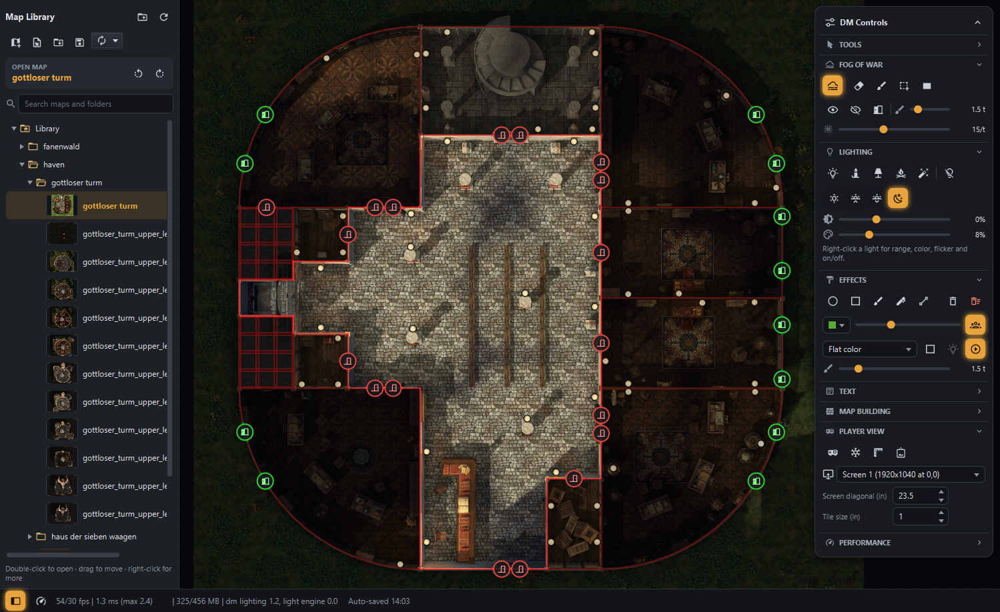

## Table of contents

- [What it does](#what-it-does)
- [Who it is for](#who-it-is-for)
- [Download](#download)
- [Requirements](#requirements)
- [Build and run](#build-and-run)
- [Technology stack](#technology-stack)
- [User documentation](#user-documentation)
  1. [Window layout](#1-window-layout)
  2. [Map library (left sidebar)](#2-map-library-left-sidebar)
  3. [Creating and importing maps](#3-creating-and-importing-maps)
     - [Multilevel maps](#multilevel-maps-buildings-with-several-floors)
  4. [Navigating the map](#4-navigating-the-map)
  5. [Player view (second screen)](#5-player-view-second-screen)
  6. [Fog of war](#6-fog-of-war)
  7. [Lighting](#7-lighting)
  8. [Doors and windows](#8-doors-and-windows)
  9. [Effects (AOE shapes and textures)](#9-effects-aoe-shapes-and-textures)
  10. [Text boxes](#10-text-boxes)
  11. [Map building](#11-map-building)
  12. [Ping and laser pointer](#12-ping-and-laser-pointer)
  13. [Handouts](#13-handouts)
  14. [Saving, auto-save and undo/redo](#14-saving-auto-save-and-undoredo)
  15. [Performance](#15-performance)
  16. [Settings file](#16-settings-file)
  17. [Keyboard and mouse reference](#17-keyboard-and-mouse-reference)
  18. [Ambient audio](#18-ambient-audio)

---

## What it does

- Imports **dd2vtt / uvtt** universal-VTT map files (for example exported from Dungeon Alchemist) including walls, lights, doors and windows, or lets you build a map from your own images (png/jpg/webp).
- Shows the map on your **DM screen** with full controls and on a **borderless fullscreen player window** on a second monitor, calibrated so that one grid tile is about **1 inch** in real life (ideal for miniatures).
- **Fog of war** with brush, area and one-click room reveal tools.
- **Dynamic lighting** with line of sight against walls and closed doors, flicker, colours, presets and time-of-day ambience.
- **Effects** such as circles, boxes and freehand areas with 25+ animated textures (fire, smoke, water, webs, chasms, ...), text labels, pings and a laser pointer.
- **Ambient weather**, including thick, high-contrast smoke-textured mist with dense billows, softer gaps, full-screen coverage and seamless edge wrapping. Intermediate intensity shows drifting smoke; **100% mist is opaque**, hiding the map beneath textured fog (text and fog-of-war remain above it).
- **Handouts**: paste images from the clipboard and show them on the player screen.
- **Ambient audio**: a library of music categories and looping sound effects, with a waveform editor that cuts long recordings into standalone clips and crossfading playback.
- Organises maps in a **folder library** with thumbnails, tags, name/tag search, drag & drop and auto-save.
- **Multilevel maps**: several floors of a building (e.g. Dungeon Alchemist level exports) shown as one map, with quick up/down level switching.
- Full **undo/redo**.

Everything you need is copied into the app's own project storage on import, so original files (for example on a USB drive) are not needed afterwards.

The in-app interface is English-only, including JavaFX-provided labels such as dialog buttons; it does not switch languages based on the computer's display locale.

## Who it is for

Game masters of D&D, Pathfinder and similar tabletop RPGs who play **in person** with a horizontal display (TV, monitor or projector) as the battle map and want to keep control (fog, lights, secrets) on a separate screen. Also useful for anyone who wants a light, offline alternative to online virtual tabletops.

## Download

Get the [latest release](https://github.com/Bowtie8904/DungeonMasterMapTool/releases/latest):

- **Windows:** download `DungeonMasterMapTool-windows.zip`, unzip it and run `DungeonMasterMapTool.exe`. Java is bundled, nothing else to install.
- **Linux / macOS:** download `DungeonMasterMapTool-linux.jar` or `DungeonMasterMapTool-macos.jar` (Apple Silicon) and run it with `java -XX:+UseCompactObjectHeaders -jar <file>` (Java 25 or newer required; the flag is optional and lowers memory use).

## Requirements

| What | Details |
|------|---------|
| Operating system | Windows (primary target), macOS or Linux with JavaFX support |
| Java | **JDK 25 or newer** (the build uses release 25) |
| Build tool | [Apache Maven](https://maven.apache.org/) 3.8+ (or use the `.mvn` wrapper folder if present) |
| Displays | One screen is enough; a **second screen** is needed for the player view |
| Memory | 2 GB free RAM recommended; large maps (>4096 px) use a disk cache |
| Map source (optional) | `.dd2vtt` / `.uvtt` files, e.g. from Dungeon Alchemist, or your own images |

## Build and run

```powershell
# run from the source tree
mvn javafx:run

# or build a runnable "fat" jar and start it
mvn package
java -XX:+UseCompactObjectHeaders -jar target\DungeonMasterMapTool-1.0-SNAPSHOT-all.jar

# run the unit tests
mvn test
```

Main class: `dmmt.DungeonMasterMapToolLauncher`.

Data locations:

- **Map library:** `dmmap-projects` beside `dmmap-audio` by default (created on first use, git-ignored; configurable with `library.folder`).
- **Settings:** `dmmt-settings.ini` next to the jar (see [Settings file](#16-settings-file)); override with `-Ddmmt.settings=<path>`.
- **Image tile cache:** `%LOCALAPPDATA%\DungeonMasterMapTool\image-cache` (fallback `~/.dmmt/image-cache`); entries unused for 60 days are pruned.

## Technology stack

| Area | Technology |
|------|------------|
| Language / runtime | Java 25 (LTS) |
| UI and rendering | JavaFX 25 (Canvas rendering, custom dark CSS theme) |
| Icons | Ikonli with Material Design Icons 2 |
| Rich text editing | RichTextFX |
| Geometry / line of sight | JTS Topology Suite |
| JSON (dd2vtt import, `.dmmap` save format) | Jackson |
| Boilerplate reduction | Lombok |
| Build | Maven (maven-shade-plugin for the fat jar, javafx-maven-plugin for `javafx:run`) |
| Tests | JUnit 5 |

Maps are saved in a versioned JSON format (`.dmmap`) that is identical for imported and custom maps, so every feature works on both.

---

## User documentation

> Tip: every button in the application has a tooltip that names its function and shortcut.

### 1. Window layout

- **Left:** the collapsible **map browser** (library and map actions).
- **Centre:** the **map canvas**. A floating **tool chip** at the top names the active tool ("Esc or right-click to exit").
- **Right:** the **DM controls** overlay, made of collapsible sections: *Tools, Fog of war, Lighting, Effects, Text, Map building, Player view, Performance*. Collapsed/expanded state is remembered. The whole panel can be collapsed and scrolls in small windows. Tabs you never use can be hidden completely in the **Settings** window (see [Settings file](#16-settings-file)).
- **Bottom:** a slim status bar with messages (auto-save, import progress, errors) and the performance toggle and readout.

### 2. Map library (left sidebar)

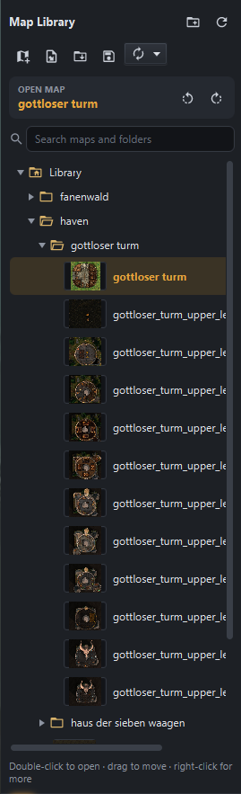

The library is the app-managed `dmmap-projects` folder shown as a tree, like a file browser.

- **Folders** group maps (campaign, cities, wilderness, ...). They can be nested, expanded and collapsed.
- Each map is shown by **name only**, with a **thumbnail** (hover for a larger preview). Thumbnails show only the map images (never fog, lights or effects) at the current rotation.
- The currently open map is highlighted, and its name is shown at the top.
- **Toolbar:** New map, Import dd2vtt, Import folder, Import multilevel map, Save, Auto-save toggle (with interval), New folder, Refresh, Rotate left, Rotate right.
- **Search bar:** case-insensitive live filter on map names, tags and folder names. The search is split into words, and **every word** must match part of the map name or a tag; words may match different fields. For example, `tav haven` finds a map named `Haven` tagged `tavern`. A matching map is shown with its parent folders, a matching folder with its content. `Esc` or the clear button restores the tree.
- **Open a map:** double-click or press `Enter`. The current map is auto-saved first.
- **Recent maps:** the list below the tree shows the maps you opened last (most recent first, size set by `ui.recentMaps.max`). Double-click one to open it again. The **Previous map** arrow beside the heading opens the last other map; press again to switch back. It auto-saves the current map and respects player freeze, and is disabled when no previous map is available. For Stream Deck, choose **DM Control > Maps > Previous map** (`maps.previous`).
- **Move:** drag & drop maps or folders onto a folder (or onto empty space for the library root). Hovering a collapsed folder while dragging expands it. Folders dropped onto a map go to that map's folder. With several entries selected, dragging any of them moves **all selected entries** (entries inside a selected folder travel with it); entries that cannot be moved (name taken, folder into itself) are skipped and listed afterwards.
- **Merge by drag & drop:** drop a map **onto another map** to build a multilevel map. The target turns green and shows what happens: map onto map → *Create a multilevel map*; map onto a multilevel map (or a multilevel map onto a map) → *Add to the multilevel map*; multilevel map onto a multilevel map → *Merge the levels into this map* (the map you drop onto keeps its name and shared settings, the dragged one gives up its levels and disappears). The level dialog opens first so you can set the order. Dragging **several selected maps** onto a map adds all of them in one go; if multilevel maps are involved, the target keeps its name and settings when it is a multilevel map, otherwise the first dragged multilevel map does.
- **Select several maps** with `Ctrl+click` / `Shift+click` to duplicate, delete or drag them all at once. Ordinary and multilevel maps can be selected together. Right-clicking a selected map preserves the selection; right-clicking an unselected entry selects only that entry.
- **Context menu on a map:** Open, Manage tags, Rename, Duplicate, Make multilevel map, Delete. **On a multilevel map:** Open, Manage tags, Manage levels, Dissolve into separate maps, Rename, Duplicate, Delete. With multiple maps selected, **Add tags**, **Duplicate** and **Delete** apply to every selected map; **Make multilevel map** is enabled only for two or more ordinary maps and merges the entire selection. It is disabled for a single map or selections containing multilevel maps. All other menu actions are disabled during multi-selection. Mixed map/folder selections disable all menu actions. **On a folder** (or empty space): New map here, Import map here, Import folder here, Import multilevel map here, New folder, Rename, Delete.
- **Keyboard:** `F2` rename and `Enter` open require a single selection. `Delete` deletes all selected maps with one confirmation listing them; deleting a single folder states how many maps it contains.
- **Duplicate** creates `Name (Copy)`, `Name (Copy 2)`, ...
- **Rename** renames the package folder and file on disk. Names cannot be empty, contain `<>:"/\|?*`, be reserved Windows names, or duplicate a name in the same folder.
- Leaving an unsaved new map asks **Save / Discard / Cancel**.

Thumbnails are refreshed only when their image inputs change, or the thumbnail is missing. Saving fog,
lights, text or camera edits does not rebuild an unchanged image-only thumbnail. Image-pyramid caches
survive same-volume package moves and renames; changed image assets or pyramid settings still invalidate
them. Copies and cross-volume moves may rebuild once. Existing path-based caches migrate when opened
at their original location; moving a legacy map before that first open may also require one rebuild.

On disk each map is a package: `<folder>/<Map Name>/<Map Name>.dmmap` plus `assets`, `imports` and `thumbnail.png` (hidden in the tree). A multilevel map is a package `<folder>/<Map Name>/<Map Name>.dmlevels` with one ordinary map package per level below `levels/` (also hidden in the tree).

**Map tags**

Right-click a map and choose **Manage tags...**. Type a tag and click **Add** (or press `Enter`); remove a tag with its small cross button. Tag names are trimmed, stored and displayed in **UPPERCASE**, including older tags and suggestions, and cannot appear twice on the same map, regardless of capitalization. The tag input also displays uppercase as you type. Suggestions come from tags already used in the library: typing `tav` displays `TAV` and suggests `TAVERN`, without autocompleting the name. An overlay below the field shows up to **five suggestions**, all visible without scrolling: navigate with **Up/Down** and accept with **Enter**, or click a row to fill the field, then add it. **Escape** dismisses suggestions. **Apply** saves the edits; **Cancel** discards them.

Select several maps and choose **Add tags...** to add the same tags to all of them without removing any existing tags. A multilevel map shows the unique tags of all its levels together; adding or removing a tag affects **every level**. Original per-level tags stay with their maps when combined, and dissolving or moving a level out retains its original tags plus later whole-map changes. Tags cannot be edited per level in Manage levels.

Suggestions are ranked by how closely they fit your input: exact matches first, then tags starting with the text, then tags containing it elsewhere. Earlier matches and fewer extra characters rank higher, with alphabetical order breaking ties. Only the five best matches are shown.

Imports automatically inherit known tags whose full name appears in the source filename, case-insensitively: if `tavern` is already used, importing `haven small criminal tavern.dd2vtt` adds it. This applies to single, batch and multilevel imports.

### 3. Creating and importing maps

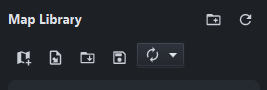

**Import a dd2vtt/uvtt map**

1. Click **Import dd2vtt** (or right-click a folder → *Import map here*).
2. Pick the file in the system file chooser. The last used directory is remembered.
3. A location dialog shows the library folder tree only. Choose or create a folder and confirm the map name (pre-filled from the file).
4. The map image, walls, lights, doors, windows and grid are converted and copied into the library. The original file is no longer used.

Enclosed rooms are automatically given DM-only labels **Room 01**, **Room 02**, etc., using the same boundaries as
Reveal room. Outside areas (regions touching the map's outer bounds) and regions that cannot fit a complete grid-square-sized
square inside their detected interior are skipped, without gaps in numbering. This excludes thin L-shaped gaps even when
their overall bounding box is wide and high. This applies to single, batch,
folder and multilevel imports; numbering starts anew on each imported map/level. Labels use the configured room-label
style, stay centred while edited and can be renamed, moved or deleted normally. Turn off **Auto label rooms**
(`import.autoLabelRooms`) in Settings to disable this for future imports; existing maps are not relabelled.

**Batch import**

- Background copying, image preparation and audio preparation share a resource-aware scheduler.
  In Settings > Storage and caches, **Work mode** (`work.mode`) defaults to `session`, which
  uses one audio preparation worker; `preparation` allows two for library preparation before play.
  Memory-intensive image preparation always uses one worker and copying is limited to two.
  Changing this live setting leaves running jobs intact and adjusts queued work; it is independent
  of the map's Performance mode toggle.
- Select several files in the chooser, or use **Import folder…** to import every `.dd2vtt`/`.uvtt` found in a folder and its sub-folders. **Import folder…** re-creates the folder's sub-folder structure in the library (a sub-folder only appears once a suitable map is found in it; empty sub-folders are skipped). A plain multi-file selection always imports flat into the target folder.
- The location dialog asks only for the target folder. Maps are named after their files; duplicates get a suffix (`Name (2)`).
- Files in the same folder that look like the **levels of one building** are imported automatically as **one multilevel map** (unless you set `import.autoMergeMultiLevel=false`, see [docs/SETTINGS.md](docs/SETTINGS.md#importautomergemultilevel); then every file becomes its own map), ordered by level number:
  - names that differ only by a level number, optionally followed by a room name: `haus_00 … haus_03`, `Inn 1`, `Inn 2`, `tower_upper_02_barracks … tower_upper_10` (levels are named `Level 02 – barracks` etc.); the number may also be in parentheses, `kings castle (1) … kings castle (3)` — the pattern left by renaming several files to the same name at once;
  - a file without a number becomes the lowest level only when its entire name matches the prefix before the level number (case-insensitive; underscores read as spaces). For example, `schilftritt_tor.dd2vtt` joins `schilftritt_tor_00.dd2vtt` and `schilftritt_tor_01.dd2vtt`, but `schilftritt.dd2vtt` stays separate. It would join `schilftritt_00.dd2vtt` and `schilftritt_01.dd2vtt`. The multilevel map is named after the matching base file.
  - Series with a repeated number (`Market 1 day`, `Market 1 night`) and merely similar names (`Goblin Cave`, `Goblin Camp`) stay separate maps — merge them afterwards if needed.
- Import runs in the background with progress in the status bar (`Importing 3/12: name...`). The open map is not switched. Failed maps are removed again, the batch continues, and a final dialog lists failures.

**Duplicate detection**

- Whenever you pick dd2vtt/uvtt files to import (single file, multi-file/folder batch import, or the files chosen for a multilevel map's levels), the app checks each file's name against the **original file name** stored in every map already in the library - never the map's current library name, since maps can be renamed after import. For multilevel maps, every level is checked individually.
- If any files match, by default (`import.duplicateBehavior = ask`) a dialog lists only those duplicates, each with its own checkbox (all ticked by default). Use **Select all** / **Select none** to toggle every row at once, then choose **Cancel** (abort the whole import), **Don't import duplicates** (skip every listed duplicate), or **Import selected** (import only the ticked ones). Files that are not duplicates are always imported and never shown in the dialog.
- Set `import.duplicateBehavior` to `always` or `never` (see [docs/SETTINGS.md](docs/SETTINGS.md#importduplicatebehavior)) to always import duplicates, or always skip them, without being asked.
- Maps saved before this check existed have no stored original file name and are never flagged as duplicates.

**Create a custom map**

1. Click **New map**.
2. Drag & drop images (png/jpg/webp) onto the canvas, or use **Add image** in the *Map building* section.
3. Position and scale layers, then draw walls if you want line-of-sight lighting (see [Map building](#11-map-building)).
4. Click **Save** and choose a folder and name in the location dialog.
5. This tool has no capability of maintaining map object assets. It is meant to be used with map images created via some other tool. You will not be able to start with a blank canvas and create a full map in this tool.

#### Multilevel maps (buildings with several floors)

Dungeon Alchemist can export every floor of a multi-story building as its own dd2vtt file. A **multilevel map** keeps all those floors together: the library shows it as **one map** (with a layers badge; the tooltip shows the number of levels and a preview of the level opened last), and you switch floors while playing.

**Create one**

- **Import:** click **Import multilevel map** in the library toolbar (or right-click a folder → *Import multilevel map here*) and select all level files at once. The level dialog lists them **lowest level at the top**, sorted by file name and with suggested level names (e.g. `haus_00 … haus_03` → *Level 00 … Level 03*). Reorder, rename, remove or add levels, click **Next**, then pick the folder and name (pre-filled with the part all file names share).
- **Batch import:** files numbered like levels are grouped automatically (see *Batch import* above).
- **Merge existing maps:** select two or more ordinary maps in the library (`Ctrl+click` / `Shift+click`) and right-click → *Make multilevel map…*. This menu action is disabled for a single selected map. Alternatively, drag a map (or several selected maps) onto another map. The maps are **moved** into the new multilevel map and no longer appear on their own; their fog, lights, effects and cameras are kept. File names do not have to match — set the order in the dialog.

**Switch levels**

- For multilevel maps with two or more levels, a small switcher appears at the top left of the map: a dropdown to jump to any level (lowest at the top; hovering an entry shows a preview of that level), then **▼** one level down and **▲** one level up, the position (`2 / 4`) and a pencil button to manage the levels.
- `Page Up` / `Page Down` go one level up / down.
- The open level is saved before switching; only the open level is kept in memory.
- Saving remembers the open level; reopening the map returns to it. A map opened for the first time starts on the lowest level.

Neighbouring floors are prefetched at low priority: their overviews and initial-view tiles are prepared
without opening those levels or changing either camera. Prefetch is bounded, superseded when you switch
maps/levels, and never changes frozen player output.

**What is per level and what is shared**

- **Per level:** fog of war, camera positions and the player view zoom, image layers, walls, doors/windows, lights, effects and text boxes.
- **Shared by all levels** (changing it on any level changes it for all): time of day, ambient brightness, weather, image layer lock, fog on/off, map rotation, DM view zoom, player zoom offset, text layer visibility and the last used text settings.

**Manage levels** (right-click the multilevel map → *Manage levels…*, or the pencil in the switcher)

- **Insert** levels anywhere: new entries are added below the selected level, from dd2vtt files, from existing library maps (moved in) or as an empty level.
- **Reorder** by dragging levels in the list (or `Alt+↑` / `Alt+↓`).
- **Right-click a level** to rename it (`F2` or double-click), delete it (`Delete`), or **move it out as a separate map**. Moving out asks for the map name, pre-filled with the level's original file/map name (or `<multilevel map> <level>`); the map is placed next to the multilevel map and keeps the shared settings it had. *Keep in the multilevel map* undoes this before you click **Apply**.
- **Apply** summarizes what happens (deleted levels, levels moved out) and asks for confirmation.
- A multilevel map left with **one level** becomes an ordinary map with the same name. Removing the **last** level asks for confirmation and deletes the whole multilevel map.
- **Dissolve** (right-click the multilevel map → *Dissolve into separate maps…*) turns every level into a separate map next to it; nothing is deleted.
- If the open level is removed, the nearest remaining level is opened (preferring the level below).
- Renaming, duplicating, moving and deleting the whole multilevel map work like for any other map in the library.

### 4. Navigating the map

- **Zoom:** mouse wheel, centred on the cursor.
- **Pan:** right-drag (or drag with a suitable tool).
- **Rotate the whole map** in 90° steps with the rotate buttons in the sidebar. Image layers, walls, fog, lights, effects, text boxes and both cameras rotate consistently and the rotation is saved.
- **Player viewport rectangle:** when the player window is open, the DM view shows a window-like rectangle (cyan border with a "Player view" title bar) representing what the players see. Drag it by its title bar with the Select tool. Hold the cursor near or beyond an unobstructed map edge to pan the DM view continuously, even with a stationary cursor or outside the DM window; the grabbed point stays under the cursor. Speed increases toward the edge (default 40-pixel zone, up to 600 logical pixels/second) and stays capped beyond it, with controlled diagonal movement at corners. Scrolling pauses over control overlays, and stops on release, cancellation, focus loss, map/level changes or player-window closure. The whole drag is one undo step; while frozen, only the staged viewport moves. Neither zoom nor map rotation changes. Enabled by default; disable or tune it in **Settings > Player screen** (`player.viewportEdgeScroll.*`).

Large images (> 4096 px) are rendered at full resolution through an on-disk tile pyramid built in the background the first time a map is opened.

### 5. Player view (second screen)

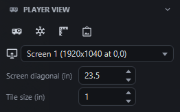

Controls are in the *Player view* section.

- **Player window** toggle: opens a borderless fullscreen window on the chosen monitor. Use the **screen selector** to pick the exact monitor.
- **1-inch calibration:** enter the physical **screen diagonal** of the player monitor (stored per screen) and the **tile size in inches** (default 1). The zoom is derived automatically so each grid tile measures that size. The **1 in test square** toggle shows a square on the player screen so you can verify it with a ruler.
- **Show grid** (grid icon on the second row): toggles grid lines over the player map, below lighting, effects and fog. The adjacent **grid opacity** slider sets line opacity from 0-100% (default 8%, `ui.gridOpacity`, shared with the DM background grid). Visibility is off by default and remembered across maps and restarts (`player.showGrid`). Works while frozen without changing DM grid visibility. Grid lines already baked into the map image cannot be hidden.
- **Freeze:** snapshots the *entire* project (map, fog, lights, effects, camera) for the players. You can switch maps or edit freely while they keep seeing the old state. You can still move the player viewport; on **unfreeze** the player view adopts the current map and the staged rectangle.
- **Subtle scene transitions:** live map/level switches use a short, eased 0.4-second crossfade, with no sliding, zooming or black flash to distract from play or move the map beneath miniatures. Unfreezing crossfades only when the map, player viewport or player-facing content changed; freezing and unfreezing without changes (or moving only the DM camera) stays seamless. Normal live panning/zooming remains immediate, and handouts are not affected.
- The player view never shows DM helpers: wall guides, door state lines, badges, viewport handles, selection outlines or text-box editing.
- **Handout** button: see [Handouts](#13-handouts).

### 6. Fog of war

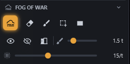

The *Fog of war* section:

- **Fog on/off** toggle: hides or shows fog without losing what is revealed. Fog tools only work while fog is on.
- **Reveal brush / Hide brush:** paint fog away or back. The shared brush size slider defaults to 0.2–8 tiles and a circular preview follows the cursor. **Alt + mouse wheel** over the map changes size by 0.1 tiles per notch.
- **Reveal area / Hide area:** drag a rectangle (dashed preview).
- **Reveal room:** one click floods the room under the cursor, bounded by walls and doors/windows (regardless of whether they are open). **Shift+click** hides the room instead. A hover preview outlines the region before you click, so you see immediately if it is not enclosed. The highlight is green for reveal (amber if unenclosed) and turns red while Shift is held to hide, even without moving the cursor; releasing Shift restores the reveal color. The tool stays armed for several rooms in a row.
- **Reveal all / Hide all.**
- **Fog sharpness** slider: fog cells per tile (5–30, default 10). Applies to all projects; existing masks are resampled.

Rendering: the DM sees fog semi-transparent, so hidden content stays faintly readable. Players see fully opaque fog except revealed or lit regions. Fog covers effects, text boxes and the laser pointer's target area, but never erases map pixels.

### 7. Lighting

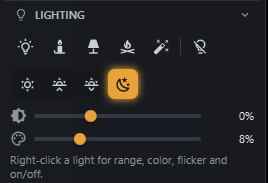

The *Lighting* section controls lights and ambience.

**Lights**

- **Add light** and **Remove light** are one-shot tools: arm the tool, then click the map (place / remove the clicked light). The tool returns to Select afterwards. `Esc` cancels.
- **Presets** (place with one click): Candle (2 tiles), Torch (8), Lantern (12), Campfire (16), Magic light (12). Ranges are in tiles and scale with the grid.
- Select one or more lights, then use **Alt + mouse wheel** over the map to change each radius independently by **1 tile per notch** (minimum 1 tile per light, no upper cap). Mixed selections change only lights. A temporary DM-only radius label follows the cursor. Each notch is one undo step for all changed lights, including fog reveals; neither camera moves. Ignored during dragging/drawing; Ctrl + wheel still zooms the player view.
- Drag lights with the Select tool. **Right-click** a light for its menu:
  - *Light on* (off lights cast nothing and reveal nothing),
  - **Fog reveal mode:** *Keep revealed* (the lit area stays revealed), *Only while lit* (default for DM-added lights), *Don't reveal* (default for imported lamps),
  - **Range** (1–12 tiles),
  - **Flicker:** Off / Candle / Torch / Strong torch / Slow pulse (imported lights default to Torch),
  - **Colour** preset,
  - **Blocked by walls**,
  - **Remove**.
- Light is blocked by walls and closed doors; open doors let light through.
- Overlapping lights (and glowing effects, see [Tactical overlays](#8-tactical-overlays)) brighten the area together and blend their colours by how much each contributes, instead of only the brightest light showing.
- **Light tint** slider: strength of the light colour over lit areas (0–30 %, saved per map).
- **Bright core** slider: adds a small, additive hot spot right at each light's own position that brightens the map art underneath (not a flat overlay), similar to the bright centers baked into some hand-painted map lights (0–50 %, default 15 %, saved per map).

**Time of day**

- Four buttons: **Day, Dawn, Dusk, Night**. Day means no outdoor darkness. Enclosed rooms stay at **Night** darkness and tint, using this map's Night ambient-brightness setting, even during Day/Dawn/Dusk. The DM view shows darkness at reduced strength so the map stays readable.
- Rooms use the same wall/door/window boundaries as Reveal room, regardless of portal state. Indoor lights illuminate and flicker normally (subject to the flicker toggle and Performance mode); outdoor lights are visually off except at Night. Their saved on/off state and fog-reveal modes are unchanged.
- During Day/Dawn/Dusk, sunlight enters from **open exterior windows and doors**. Closed windows and doors block it. Each source fans only through its own opening, so closing one exterior door does not change sunlight through a nearby door. Sunlight stays bright through the inner 30% of its reach, then fades gently over a reach of eight tiles or eight opening widths (whichever is larger). Only openings connected to the outside create sunlight; open interior doors/windows can transmit it. Sunlight never reveals fog.
- A neighbouring room at least **one map tile away** from an exterior opening does not block its incoming sunlight. A closer wall can block it, and walls inside the receiving room still cast shadows. This clearance is independent of the opening's length, so long doors do not place their sunlight source inside distant buildings.
- **Ambient brightness** slider (−50 % to +100 %): adjusts the darkness of the current preset for this map only. Double-click resets; disabled at Day.
- The Dawn/Dusk/Night darkening and colour tint blend with the map using a multiply blend instead of a flat colour painted over everything, so the map's own texture and contrast stay visible underneath instead of washing toward one flat colour.

### 8. Doors and windows

Imported doors and windows, and those drawn with the Map building tools, are interactive objects.

- Each has a round **icon badge** in the DM view (open/closed glyph, green when open and red when closed by default for both doors and windows) above the fog. Door and window colours remain independently configurable; existing settings are preserved.
- With the Select tool, **click the badge or the door line** to open or close it. Hovering highlights it.
- State affects line of sight and lighting immediately, is undoable and is saved with the map.
- With Select, **right-click a badge or line** to change its type to **Door** or **Window**, or choose **Delete** to remove it. Type changes preserve position, length and open/closed state; both changes and deletion are undoable.

### 9. Effects (AOE shapes and textures)

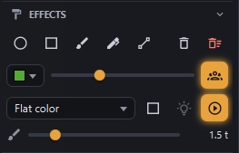

Draw areas of effect that both DM and players see (below fog, above map and lighting).

**Tools**

- **Circle:** drag from the centre outward. **Box:** drag corner to corner. **Draw:** freehand stroke whose thickness is the brush size. **Pen:** thin freehand line in the selected colour. **Line:** straight line with the brush size as thickness.
- A live size label (in tiles, DM only) shows while dragging, e.g. radius `2.5` or `3 x 2`.

**Style**

- **Colour** and **opacity** (10–100 %) apply to new shapes and to the selected shape.
- **Texture** dropdown: Flat colour, Smoke, Fire, Water, Lava, Acid/slime, Ice/frost, Lightning, Arcane runes, Darkness/void, Mist/fog, Blood, Spider web, Holy light, Grease/oil, Sand/dust storm, Wind gusts, Radiation/aura, Poison/toxic gas, Swamp/mud/bog, Rubble/debris, Thorns/brambles, Force/shield, Necrotic/shadow rot, Entropy/portal and Chasm/broken earth. Textures are procedurally generated, animated and tinted with the effect colour; picking a texture loads its default colour and opacity, which you can change (orange water looks like lava, green like acid). Arcane uses a compact field of varied angular glyphs that stays legible in small shapes, not a large circular diagram.
- **Border** toggle outlines a textured shape.
- **Arcane movement:** the rune field wanders smoothly with irregular changes in direction and speed, rather than scrolling along a fixed path.
- **Light emission** (bulb) toggle: the effect glows and lights up dark maps (fire, lava, lightning, arcane, holy light, radiation, portal and force by default). It can be switched on or off for any effect afterwards, whatever the texture default.
- **Animations** toggle (per map): freezes all textures to a static frame to save performance.
- **Players see:** hides a shape from the player view (shown dashed and dimmed with a crossed-out eye for the DM). Right-click any shape with Select for a *Visible to players* menu item.
- **Brush size** slider for Draw, Line and the fog brush. **Alt + mouse wheel** over the map adjusts this same size by 0.1 tiles per notch within the configured limits, updating both sliders and the preview immediately. A small DM-only size label follows the cursor and disappears after 0.9 seconds. Neither camera moves, and no content or undo history changes. Adjustments are ignored during a stroke; Circle and Box remain drag-sized and Pen remains fixed-width.

**Editing**

- Select tool: click to select, drag to move, drag the **bottom-right handle** to resize/stretch. `Delete` or the Delete button removes a shape; **Clear all** removes every shape.
- Everything is undoable and rotates with the map.

### 10. Text boxes

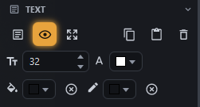

- **Text** tool: click-drag to draw a box (a plain click creates an auto-sized one) and start typing. Click a box with the Text tool, or double-click it with Select, to edit. `Esc`, clicking outside or switching tools finishes editing.
- Text wraps to the box width, is centred and clipped at the edge. **Auto-size** boxes grow and shrink with the text (maximum width 12 cells); manually resizing turns auto-size off. The *Auto-size* toggle switches it per box.
- **Font size** and **text colour** apply to newly typed text or to the selected text (or all text when a box is selected but not edited).
- The insertion caret matches the active text colour, so it stays visible on dark text boxes and room labels.
- **Background** and **border** colours (transparent by default, opacity supported, "no fill" / "no border" buttons). Corners are rounded.
- Select tool: click to select, drag to move, use the 8 handles to resize, `Delete` removes.
- **Text layer** toggle shows/hides all text in DM and player views. Text boxes are drawn below fog.
- Last-used settings are remembered per map (with a global fallback).
- `Ctrl+C` / `Ctrl+V` copy and paste a box, including into another map.
- **Room labels** created from Map building use the same text editing, styling, movement, resize, deletion and copy/paste controls. They are always DM-only: there is no crossed-out eye badge or *Visible to players* option, and the Text section's *Players see* control cannot publish them.
- New room labels use their own subtle default style: 30px light text on a translucent dark background, without a border. Configure font size and colours in **Settings** by searching for **room label**; current Text options do not affect new labels. Each label can still be styled individually with the Text controls.
- A new label stays **centred on its room** as you type, delete text or change its size, including during in-place editing. Dragging or nudging it manually (also in a group) disables automatic centring for that label. Undoing the move restores it. Centring persists when saved and rotated; pasted labels are manually placed and no longer anchored to the source room.

### 11. Map building

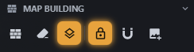

- **Add image** (or drag & drop): adds an image layer, which starts unlocked so you can position it.
- **Move and resize** layers with drag handles. **Snap layers** snaps in half-tile steps. `Delete`/`Backspace` removes the selected layer. Per-layer rotation is not supported; use whole-map rotation.
- **Lock image layer** toggle: while locked, layers cannot be selected, moved, resized or deleted. It is locked by default for imported dd2vtt maps and unlocked for new custom maps, and is saved per map. A banner on the canvas warns while layers are unlocked and offers a **Lock** button.
- **Wall tools:** *Wall* draws segments (half-tile snap, hold `Shift` for free placement). *Erase wall* removes walls, doors and windows, including imported ones. Hover highlights the exact segment or portal the next click will delete. Deletion is undoable and updates lighting and room boundaries.
- **Draw door / Draw window:** drag from one endpoint to the other, with flexible length and the same half-tile snap (`Shift` for free placement) as walls. The result behaves like an imported door or window, including opening/closing, lighting and room boundaries. Creation is undoable and saved with the map.
- **Room label:** hover to see a **blue room highlight**, then click to place an auto-sized name box and start typing. Preview and placement use the same wall, door and window boundaries as Reveal room, regardless of their open state, to find an interior position. Outside areas (those touching the map's outer bounds) place the label at your clicked cursor position, not the region's centre, so you can name several small parts of one large outside area. The label stays centred on that clicked point while typing. This works with fog disabled; Shift does not change the blue preview, and neither preview nor placement changes the reveal mask. Labels stay DM-only, persist with the map and can be edited or moved like [text boxes](#10-text-boxes).
- **Wall layer** toggle: shows or hides walls in red together with door/window lines and badges (DM only, session-only). Choosing a wall, door or window drawing tool shows it again.
- These tools can be hidden individually in **Settings > DM controls tabs > Map building** and armed through the local API (`building.drawDoor`, `building.drawWindow`, `building.roomLabel`).
- **Multi-selection (Select tool):** drag a rectangle on empty space to select lights, text boxes, effects and unlocked image layers (the rectangle turns green while it would select something). `Ctrl+click` adds or removes items. Drag any member to move the group, `Delete` removes it, all as one undo step. Doors and windows are not part of groups.

### 12. Ping and laser pointer

- **Ping** (`P`, crosshair button in the Tools row): click the map to flash an animated marker that fades out, in both DM and player views.
- **Laser pointer:** hold the **middle mouse button** to show a red dot with a short fading trail at the cursor. It works with every tool without changing it, is drawn above fog, and is shown to players only when they are viewing the current map (not while frozen or showing a handout).

### 13. Handouts

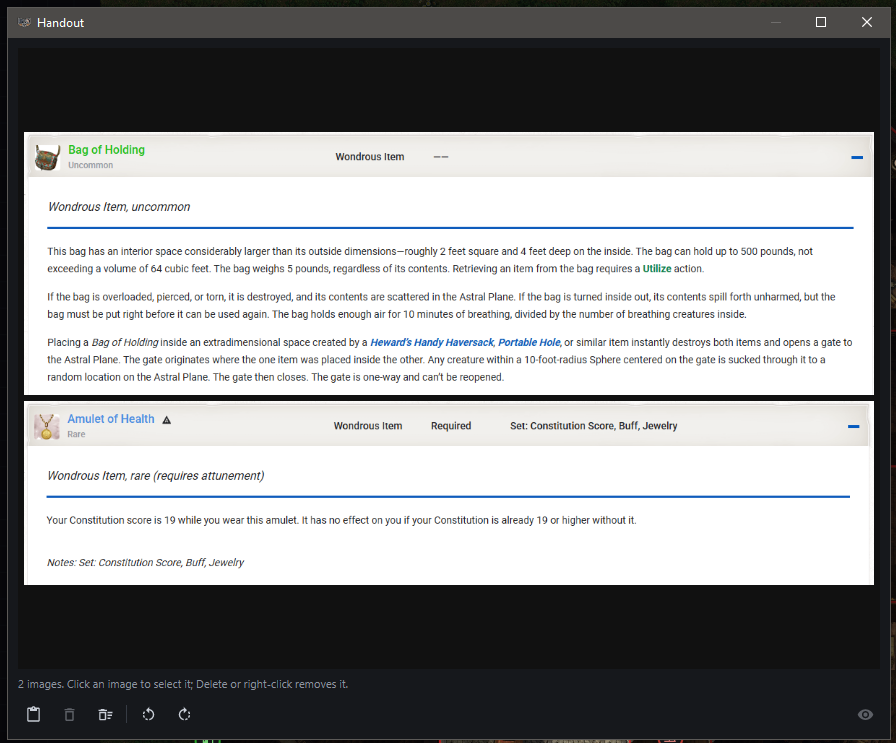

Show images such as NPC portraits or letters to your players.

1. Click **Handout** in the *Player view* section. A separate DM-side window opens (one instance).
2. Press **Ctrl+V** in that window or click **Paste**. Accepted: image data (browser "Copy image", Snipping Tool) and copied image files (png/jpg/webp/gif/bmp). Every paste **adds** an image.
3. All images appear together in an **auto-fitted grid** that maximises the covered area while keeping aspect ratios.
4. **Rotate left/right** in 90° steps so the handout faces the intended player around the table. Rotation applies to the whole arrangement.
5. Click an image to select it, then press `Delete` or use the right-click **Delete** or **Delete selected**. **Clear all** removes everything. The selection highlight is never shown to players.
6. Switch on **Show to players**. The player screen then shows only the handout on black. Switch it off and the player view returns to the live or frozen map. It is disabled without images or an open player window.

Enable **Mirror for opposite side** using the opposing vertical arrows icon toggle beside the rotation buttons to show two copies facing opposite sides of the table, with one rotated 180 degrees (text is not reflected). The layout is recalculated to fit each half, rather than shrinking the full-screen arrangement. At 0/180 degrees the copies occupy the top and bottom halves; rotate to 90/270 degrees for left and right halves. Both copies show the same images, including when showing only a selection. The DM preview stays unrotated and selectable. Mirroring is off by default and is not saved.

Closing the handout window stops showing it but keeps the images for reopening during the same application session. Reopening leaves **Show to players** off and clears the selection; use **Delete** or **Remove all images** to remove retained images. Handouts are session-only and are not kept after exiting the application.

### 14. Saving, auto-save and undo/redo

- `Ctrl+S` or the **Save** button saves the project as `.dmmap`. It stores image layers, walls, doors/windows states, fog mask, lights, time of day and ambient brightness, effects, text boxes and cameras.
- **Auto-save** is on by default for maps that already exist on disk: every 2 minutes (1, 2, 5 or 10 selectable) when there are changes, plus when the window loses focus or on close. It runs in the background and is postponed during a drag. The status bar shows "Auto-saved HH:mm". New, never-saved maps are not auto-saved.
- **Undo `Ctrl+Z` / Redo `Ctrl+Y`** covers layer moves, rotation, lights (add, remove, move, settings), doors and windows, fog edits, effects, text boxes, walls, time of day and ambient brightness. Undo history is per session. Both views update immediately.
- The status bar names the undone/redone action. A fading cyan outline marks affected content in the current DM viewport for about one second: resulting bounds after moving/resizing, restored objects, former locations of removed objects, or the changed door/window. Fog feedback follows the affected region's outline. Global changes without a local target show only the status message. Feedback never moves the camera or changes selection; the next undo/redo replaces it, and map/level changes clear it. It is not saved or shown in thumbnails or live/frozen player output.
- Saved projects stay loadable even when the original import files are gone.

### 15. Performance

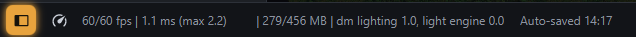

- The base layer (background, grid, images) is drawn on its own canvas, the light map is cached and only recomputed when needed, and the frame rate drops automatically when nothing moves (see the `render.*` settings).
- **Performance readout** in the status bar: actual/limit fps, average and worst render time, heap usage and the two slowest render parts (the tooltip lists all).
- **Performance mode** toggle (bottom-left): a temporary override for weaker machines. It lowers light-map resolution, slows texture animation, disables flicker, uses coarser tiles and merges fog cells, without touching your data or other settings. How much it reduces is configurable with the `performance.*` settings (see [docs/SETTINGS.md](docs/SETTINGS.md#performance-mode)).
- The **Animations** toggle in the Effects section disables texture animation per map.

### 16. Settings file

**Settings window:** click the **cog button** in the DM controls header (or in the status bar at the bottom) to open the settings window. It lists every setting that has no control in the DM controls (zoom limits, click tolerances, fog fade times, light and weather presets, effect texture defaults, caches, colours, ...), grouped by category. Pick a category on the left (related categories sit next to each other; related settings are grouped in collapsible blocks, e.g. player zoom, map image cache, one block per time of day, weather type, light preset or effect texture) or type into the **search field** (matches names, keys, descriptions and the keywords of docs/SETTINGS.md, e.g. "sunset", "battery" or "slow computer"; several words must all match). Hover a setting for a tooltip with what it does, its range and its default; the arrow button restores the default. Changes are saved to the settings file and apply immediately, except entries marked *restart required*. The first category, **DM controls tabs**, lets you hide whole tabs (e.g. Effects or Performance) from the DM controls overlay if you never use them. Expand a tab's **controls** group there to show or hide its individual controls, such as the candle preset, screen diagonal field or brush-size sliders. Each slider/field's labels and readouts disappear with it, and empty rows collapse. All controls are shown by default; choices are saved globally as `ui.controls.hidden`, apply immediately and survive restarting or hiding/restoring a whole tab. Hiding a control does not change its value, disable its tool or remove keyboard shortcuts (including Alt + mouse wheel for brush size).

Global preferences are stored in `dmmt-settings.ini` next to the jar as plain `key = value` lines with `#` comments. The file is created with every setting and its default; settings added by a newer version are appended with their defaults at startup, and unknown keys are preserved. Invalid values fall back to defaults and numbers are clamped to their allowed range. Delete a line to restore its default.

**Every entry is documented in [docs/SETTINGS.md](docs/SETTINGS.md)** (default, range, when it applies, what it does, and search keywords). `dmmt-settings.default.ini` is a copy of a freshly created file.

Highlights:

| Key | Meaning |
|-----|---------|
| `player.screenIndex`, `player.tileInches`, `player.screenDiagonalInches.<n>`, `player.zoom.*` | Player monitor, 1-inch calibration and player zoom |
| `fog.cellsPerGrid`, `fog.softness`, `fog.revealSeconds`, `fog.hideSeconds`, `fog.fadeEasing` | Fog sharpness, soft edges and fade animation |
| `lighting.*`, `lightPreset.*`, `lightMenu.*`, `timeOfDay.*` | Lighting, light tool presets, light menu choices, time-of-day darkness |
| `render.*`, `performance.*` | Frame rates and performance mode |
| `input.*`, `dm.zoom.*` | Click tolerances and DM zoom |
| `weather.*`, `ping.*`, `laser.*` | Weather particles and thunderstorm lightning, ping and laser pointer look |
| `cache.*`, `library.folder` | Memory/disk caches and map library location |
| `texture.<kind>.*` | Per-texture colour, opacity, soft edges, light emission and animation layers |

**Thunderstorms:** select **Thunderstorm** in the Weather tab for rain and occasional lightning flashes in both
views. Each strike crackles through 3-5 closely clustered, irregular flashes with varying brightness and overlapping, lingering fade-outs.
Lightning temporarily lights the map through ambient darkness, but remains below fog of war and text and
never reveals hidden areas. **Intensity** adjusts rain only; **Lightning interval** independently sets the average
seconds between strikes (2-120, default 7, with natural variation; lower means more frequent). Both controls are
undoable and saved with the map; the interval is shared across multilevel maps. Double-click resets a slider.
The global Animations toggle disables flashes; a frozen player view retains its captured frame.
Rain appearance, default interval, flash duration, brightness, opacity and colour are configurable in
**Settings > Weather > Thunderstorm** (see [Weather settings](docs/SETTINGS.md#weather)).
The control API exposes the appended Thunderstorm choice and `weather.lightningInterval`
(see [API](docs/API.md#weather)).

Most values apply when the window regains focus after you saved the file; entries marked *Restart required* apply at the next start. Use `-Ddmmt.settings=<path>` to use a different file.
### External controls and local control API

**API / Stream Deck control names:** edit
[`src/main/resources/dmmt/api/control-names.properties`](src/main/resources/dmmt/api/control-names.properties)
to set short names by control ID (for example, `lighting.torch=Torch`). Rebuild and restart to apply them.
These names are independent of tooltips and settings labels; endpoints stay unchanged. Music categories and
sound effects keep their live library names unless you add an exact ID override.

**Control tooltips:** edit
[`src/main/resources/dmmt/api/control-tooltips.properties`](src/main/resources/dmmt/api/control-tooltips.properties)
to set descriptive hover help by the same control IDs. These descriptions are shown in the app and exported
as the API's `tooltip` field. Stream Deck's control dropdowns use the descriptions to distinguish, for example,
music playback, sound-effect playback and combined playback; **Title > Name** still uses the short name.
Dropdowns never use the short title; if a tooltip is unavailable, they show the stable control ID instead.
Unmapped controls keep their live help text or display name. Rebuild and restart after editing either file;
these are bundled resources, not settings-file entries.

Tests load independent names and tooltips from `src/test/resources/dmmt/api/`, so changing
production wording does not require updating test expectations.

The optional **local-network HTTP API** controls the DM UI without giving the application keyboard focus. Enable
`api.enabled` in Settings under **Local control API**. Enabling/disabling and port changes apply immediately,
without restarting. Hand edits in `dmmt-settings.ini` apply when the DM window regains focus.
The default port is `7071`. Copied URLs use the computer's active LAN IPv4 address, for example
`http://192.168.1.100:7071`, so phones and other devices on the same network can call them.
In **Settings > Local control API > Copy address**, choose `network` (default) for LAN URLs or `local` for
`127.0.0.1` URLs. This applies immediately to future copies and does not change network accessibility.

Right-click URL-copy actions are hidden by default. Turn on **Show URL options** (`api.showUrlOptions`) in
**Settings > Local control API** to show API URL actions on library maps and API/key-image URL actions on DM
controls. This only changes menu visibility; all API endpoints continue to work normally.

When shown, right-click a DM control or a library map and choose **Copy API URL**, then use that URL in an external control device's
HTTP-request action. Toggles invert their current state; colour, dropdown and numeric controls include their current
value in the copied example. Dropdowns also offer **Copy API index URL** with `?index=0` for the first option,
avoiding long encoded names. Sliders also have increment/decrement examples. Commands use the same UI handlers as
manual interaction, including changes to selected objects and frozen-player behavior.

See [Local API reference](docs/API.md) for commands, discovery, slider units, map UUIDs and zero-based level selection.
The server is disabled by default and has no authentication. It listens on all IPv4 interfaces; enable it only
on trusted networks and do not forward its port to the internet. The app does not change firewall settings;
an existing OS firewall or Wi-Fi client-isolation policy can still prevent access.

**Control key artwork:** right-click a control and choose **Copy key image URL**. The copied address serves a
144x144 PNG based on the control's tool icon (dropdowns use their tab's icon, and value controls use fitting
symbols), ready for a Stream Deck or any other device that fetches its own key images. Master, music and effects
volume controls all use a speaker/volume icon, including their increment/decrement variants. Music categories and sound
effects use **their own colour** instead of white, so a deck full of audio buttons matches the overlay (very dark
colours are lightened so the glyph stays readable). Numeric controls also offer **Copy increment key image URL**
and **Copy decrement key image URL**, with distinct plus/minus badges. The image is rendered on request, so it
always matches the control's current icon and colour; the API must be running.

### Stream Deck plugin

A ready-made Elgato Stream Deck plugin lives in [`streamdeck-plugin/`](streamdeck-plugin/README.md). Six generic
actions cover music categories, sound effects, DM controls, sliders, dropdowns and map switching, so there is
nothing to maintain per category. Keys stay **highlighted while the thing they control is active** - start a
different music category and the previous key dims by itself, even with the music overlay closed - and each key
draws the application's own artwork for the control it triggers. It polls the API in one batched request per interval and goes completely silent when
no key is visible. See its README for installation and setup.

### 17. Keyboard and mouse reference

| Input | Action |
|-------|--------|
| `Esc` | Cancel the active tool / return to Select / clear selection |
| Right-click (no drag) | Same as `Esc` while a tool is active; opens context menus in Select |
| Right-drag | Pan |
| Mouse wheel | Zoom around the cursor |
| `Ctrl` + mouse wheel | Zoom the player view (also takes precedence when `Alt` is held) |
| `Alt` + mouse wheel (map canvas only) | Adjust each selected light's radius by 1 tile, or fog brush / Draw / Line size by 0.1 tiles; ignored during the respective drag/stroke. Other tools do nothing, without zooming |
| Middle mouse (hold) | Laser pointer |
| `P` | Ping tool |
| `Ctrl+S` | Save |
| `Page Up` / `Page Down` | One level up / down (multilevel maps) |
| `Ctrl+Z` / `Ctrl+Y` | Undo / Redo |
| `M` | Open / close the audio overlay |
| `Ctrl+C` / `Ctrl+V` | Copy / paste text box (in the handout window: paste image) |
| `Delete` / `Backspace` | Delete selected layer, light, text box or effect |
| `Ctrl+click` | Add or remove an item from the selection |
| Arrow keys (focused map canvas only) | Nudge selected movable objects by 0.1 grid tile in the displayed direction, ignoring mouse snapping |
| `Shift` + arrow keys (focused map canvas only) | Nudge by 1 grid tile |
| `Shift+click` (Reveal room) | Hide the room |
| `Shift` (wall tool) | Free wall placement without snap |
| `Enter` / `F2` / `Delete` (map browser) | Open / rename / delete |

Arrow-key nudges move lights, effects, text boxes and unlocked image layers together without changing selection or the active tool. Holding arrows repeats; a continuous gesture is one undo step (including persistent fog reveals), ending when all arrows are released, focus leaves the canvas or selection changes. Locked images, walls and doors/windows do not move. Nudging is disabled during mouse drags, drawing and geometry editing; arrows in text editors, controls, the map library and dialogs retain their normal behaviour. Both views update immediately, except that a frozen player view remains frozen.

---

### 18. Ambient audio

The tool plays background music and layered sound effects at the table, without leaving the map. Audio is
deliberately **not** part of the DM controls sidebar: a small transport group sits at the **bottom right of the
status bar** (previous, play/pause, next, an **Audio** button and a **Library** button), and the Audio button - or
the `M` key - opens the
audio overlay on top of the map. The Library button opens the audio library window straight away, without going
through the overlay. It is optional: switch `audio.enabled` off in the settings and the status bar
group, the overlay and everything audio-related stay unloaded.

The **current music track name** appears immediately to the left of the transport buttons in a fixed-width
180-pixel display. Long names scroll automatically, pausing briefly at each end before repeating; short names
stay still. Hover to see the full name. The name remains visible while paused and clears when music is stopped.

**The library.** The library button in the overlay opens the audio library window. Import `.mp3` and
`.wav` files, either file by file or a whole folder; every import is copied into the library folder
(`audio.folder`, `dmmap-audio` next to the settings file by default), so moving or deleting the original does not
break anything. Tracks can be renamed, deleted and moved freely. Once copying finishes, a recording appears
with its preparation state; you can rename, categorise and style it while analysis continues. It cannot play,
enter a playlist, open a preview, or be cut/edited for loudness until preparation succeeds.

The library's multi-row import panel shows ready, active, waiting, failed and cancelled counts, with a
separate progress row for each active file. Percentages describe its current step (copying, loudness/waveform
analysis or playback preparation), not the entire import. The table's **Preparation** column also shows
a progress bar beside each importing track; waiting tracks use an indeterminate bar, and ready, failed
or cancelled tracks show just their status. Preparation is the first column and hides automatically
when all tracks in the current category/search results are ready; it reappears for pending, failed or
cancelled tracks. **Cancel unfinished imports** stops outstanding
work without removing ready tracks; **Retry failed / cancelled** retries either kind. Buttons wrap onto
another row in narrow windows rather than truncating their labels. A track's context menu offers
**Prepare next** and **Retry preparation**.
Closing the library window leaves the queue running; reopen it through the status-bar **Library** button
to inspect progress. App shutdown stops the queue, and interrupted pending preparations resume on the next
launch. Failures remain visible and retryable rather than being treated as playable recordings.

**Consistent loudness.** Every new import and newly cut clip is analyzed in the background and automatically
matched toward **-23 LUFS** (perceived loudness), rather than matching only its loudest peak. The adjustment is
fixed throughout playback: dynamics stay intact, without volume pumping. Boost is limited to **+24 dB** and a
**-1 dBFS sample-peak ceiling**, so a very dynamic recording may remain quieter than the target; silence is not
amplified. This is per-file matching, not a limiter for the combined mix of many simultaneous effects.

Loudness analysis now collects peak and gated block statistics in one decode, with bounded-memory
temporary storage. The same decode creates the existing waveform and timbre-fingerprint cache used by
the clip editor. A boosted playback copy may require a separate preparation pass; original files and
the loudness/peak-safety rules remain unchanged.

Select a single file in the audio library and use the **Loudness** toolbar button or right-click **Loudness...**.
The dialog shows its measured loudness, automatic recommendation and saved gain. Choose a gain in decibels and
press **Apply override** to save your own baseline (negative = quieter, positive = louder), or **Use automatic**
to restore the recommendation. Overrides replace the automatic gain, rather than adding to it. Manual gains
allow **-60 to +24 dB**, even when a file has occasional loud peaks that block automatic boosting.
Above the peak-safe headroom, a linked-channel, lookahead **peak limiter** keeps sample peaks below -1 dBFS
instead of clipping them. This raises the quieter parts while controlling loud peaks; strong boosts can reduce
dynamics. Resetting to automatic restores the uncompressed, peak-safe version.
Preparing a boosted playback copy runs in the background with a progress indicator. Once ready, running music,
effects and waveform previews switch copies at their current positions, preserving pause/fade/loop state.
The master/music/effects sliders still control the overall mix.
The **Gain** column distinguishes automatic and manual levels, and **Preview** opens the waveform player.
Existing library files keep their previous levels until you choose **Analyze file** or apply a manual override.
Playing instances automatically switch to the prepared copy when it is ready.

Original imported files stay unchanged and are still used for lossless cutting. When boosting requires it, the
library also stores a prepared PCM WAV playback copy, which uses extra disk space (including for MP3 imports).
Prepared `*.playback.wav` and `*.peak-safe.wav` copies live in `dmmap-audio/files/playback/`, while
`*.limited.wav` copies live in `dmmap-audio/files/limited/` (under your configured audio folder).
For an existing library, move these copies into their respective subfolders yourself, keeping their file names;
no edits to `library.json` are needed. Original imported and cut files stay directly in `files/`.
Limiter copies are rendered from the original for the requested gain, not by repeatedly processing earlier boosts.
Both the original library copy and prepared playback copy are removed when the entry is deleted. Per-file gains
are saved in `library.json`, not in global settings or map projects.

**Folders become categories.** A folder import also walks all subfolders, and every music file found in a subfolder
lands in a category named after its direct parent folder - so a tree like `Music/Combat`, `Music/Tavern`,
`Music/Travel` imports into three ready-made categories in one go. Nested deeper (`Music/Fantasy/Boss/track.mp3`)
only the direct parent (`Boss`) counts. Existing categories are matched without regard to case ("combat" finds
"Combat"), new ones are created with the folder's exact spelling. Files lying directly in the picked folder keep
the category that is selected in the window, and when you import into the sound effects view the folder names are
ignored.

**Checked by content.** Files are checked by content, not by
extension: a file that is named `.mp3` but does not actually contain MP3 audio - a damaged download, or a file taken
out of the internal (encrypted) library folder of another audio tool - is rejected with an explanation instead of
being imported as an unplayable two-second track. Always import the original audio files, not another
application's library folder.

**Music categories and sound effects.** Audio is either **music**, sorted into categories such as *Adventure*,
*Combat* or *Tavern*, or a **sound effect** such as wind, rain, birds or waves. The library window keeps the two
apart: the **Music categories** list fills the left side, the single **Sound effects** entry sits below it under its
own heading. Create, rename and delete categories, give each one a colour and an icon, and **drag tracks between
categories - and onto or off the Sound effects entry**, which turns them into sound effects or back into music of
the category you drop them on. Sound effects get their own colour and icon too. Colour and icon are both in the
right-click menu (**Choose colour...**, **Choose icon...**); the icon picker searches the **complete Material Design
icon set** plus custom illustrated mountain and cave icons, so typing `mountain` or `cave` finds those landmarks
and `tree` lists every tree icon. The suggested icons favour wilderness and nature - forests, terrain, volcanoes,
trees, leaves, mushrooms, waterfalls, wildlife, water and weather - rather than mostly urban/modern themes.
Deleting a category keeps its files and moves them to *Uncategorised*. Changing a music track into a sound effect
(and back) is a right click away.

**Hiding entries from the overlay.** Right-click a category or a sound effect and choose **Hide in overlay** to keep
it out of the audio overlay without deleting anything - useful for a *Christmas* category you only need once a year.
Hidden entries are **greyed out** in the library window, still play, and keep their API endpoint; **Show in overlay**
brings them back. *Uncategorised* is hidden this way by default, and a category that contains no music at all is
left out of the overlay until it has a track.

**Cutting long recordings.** Select a long file and choose **Cut clips** to open the waveform window. It shows the
whole recording, so the gaps between the songs are easy to spot; click anywhere to listen from there, `Space` plays
and pauses, the mouse wheel pans and `Ctrl` + wheel zooms. Playback always starts at the playhead, so clicking into
the waveform and pressing play auditions that spot and not the beginning of the file, and the transport button shows
a pause icon while the preview runs. Playback repeats what you see: with **Loop** switched on
(the default) the selected range repeats endlessly, and when nothing is selected the visible part of the waveform
does - so zooming into a song is all it takes to listen to it again and again. Loops also restart at the end of the
file, including selections that reach that boundary; switching Loop off stops playback at the selection or file end.
Editor loops use the same preloaded, equal-power crossfade as sound effects
(`audio.effectLoopCrossfadeSeconds`, default 0.5 seconds, limited to half the loop range).
This lets you audition a smooth rain/ambience seam without changing the samples written by **Create clip**.
Drag across the waveform to select a
song, fine-tune the
start and end in the time fields, and **Create clip** writes exactly that range into the library as a standalone
audio file. **Detect** finds the songs automatically by looking for the gaps between them. It is built to work
without tuning: it measures the perceived loudness (RMS) of every 50 ms frame, derives the silence threshold from
the file itself (26 dB below that recording's own music level, so a quiet ambience mix and a loud battle mix both
split correctly), retries with a higher threshold if the file does not split, and merges gaps that are broken apart
by a single click. A candidate gap only becomes a song border when it is at least 18 dB quieter than the music
around it, which keeps a quiet passage inside one long ambient piece from being chopped into fragments. Playlists
that cut from one song to the next with a fade of only a few hundred milliseconds are caught too: a gap that short
counts when the music runs uninterrupted for at least a minute either side of it, which distinguishes it from the
dense clusters of short rests inside percussive battle music. The status
line reports the threshold that was used. All of it is tunable with the `audio.cut.*` settings, and
`audio.cut.autoThreshold = false` goes back to the fixed `audio.cut.silenceDb` level.
Many hour-long ambience uploads crossfade their songs into each other and contain no silence at all, so **Detect**
additionally looks for **changes of character**: it fingerprints the sound of every second of the file and marks the
points where two internally similar stretches meet that do not resemble each other. That splits a recording with no
gaps whatsoever. If the upload turns out to be one piece looped over and over, the repeats are recognised and
proposed only once instead of as a dozen identical clips. Use `audio.cut.changeSensitivity` to get more or fewer
songs, `audio.cut.changeWindowSeconds` for the scale it works on, and `audio.cut.detectChanges = false` to switch it
off and rely on silence alone.
A recording that is simply **one piece looped** for an hour defeats that too, because every border in it is equally
strong and so none of them stands out. Those are found separately, by reading the loop length off the file's own
self-similarity, and only one pass of the piece is proposed, starting at the beginning of the looped stretch so the
clip is not cut out of the middle of a repetition. A 61-minute upload that used to come out as a single unusable clip
now yields the 1:45 song it loops 35 times, and a three-hour upload of one 2:38 piece yields that piece instead of 139
fragments of it. Turn it off with `audio.cut.detectLoops = false`.
In **Detected tracks**, Ctrl-click selects multiple songs and Shift-click selects a range. Every selected track is
highlighted in the waveform, so you can see exactly what the batch actions will touch.
**Merge selected** replaces them with one track spanning the earliest start to the latest end, including the gaps
between them. **Delete selected** (or `Delete`/`Backspace` with the list focused) removes proposals and their waveform
markers without changing the source audio. **Create selected**, beside **Create all**, exports only the selected
tracks; **Create all** exports every remaining proposal, never restoring deleted ones.
To move a detected track's start or end, **drag its border in the waveform**: select that one track (or drag a range
by hand), move the mouse onto one of the two bright borders of the highlighted range - the cursor turns into a resize
arrow - and drag. The list entry and the exported clip follow the drag immediately; the other border and all other
proposals stay where they are. Hold `Shift` while pressing to start a new selection on top of a border instead, and
use `audio.cut.edgeGrabPixels` if you want a larger or smaller grab area. The **From/to** fields (including
milliseconds) plus **Update bounds** still do the same thing by typing.
**Clip name** supplies the base for batch exports: for example, `Forest` produces `Forest 01`, `Forest 02`, etc.,
using each track's position in the list. If that base already has numbered tracks anywhere in the library,
numbering continues after the highest existing number (case-insensitive): after `Combat 12`, the next file starts
at `Combat 13`. Gaps are not reused. Selecting tracks and finishing exports keep your entered name.
**Create clip** uses the entered name without adding a number; a blank batch base falls back to the source name.
Cutting is lossless: MP3
clips are copied frame by frame, WAV clips sample by sample, so nothing is re-encoded. Writing clips also happens in
the background: the progress bar and status line at the top of the window report "Creating clip 3 of 17" and finish
with the number of clips added to the library.

**Playing.** Press `M` or the **Audio** button in the status bar (close it the same way, with `Escape`, or with a
click on the dimmed background). The overlay shows two rings: music categories on the left, sound effects on the
right. Each entry is a small round button showing only its icon **in its own colour** - the name is in the tooltip -
and every active button lights up with the same accent ring and glow, so what is running is obvious at a glance.
Categories that are hidden or hold no music are left out of the rings.
To start at a particular song, right-click a music file in the library and choose **Play**. This starts its
category at that song, then continues with the usual playlist order (or shuffle); waveform preview is unchanged.
Click a category to play it - its tracks run one after another, shuffled by default (`audio.shuffle`), crossfading
into each other - and click it again to stop. Music transitions use the same preloaded second voice and
equal-power overlap as sound effects, with their own setting `audio.musicCrossfadeSeconds` (default 4 seconds, 0 = hard
cut): the upcoming song is preloaded shortly before the current one ends, so songs following each other, a
single-song category repeating itself and **Loop current song** all blend smoothly without a loudness dip. The centre of the left ring holds previous,
play/pause, next and stop plus the **name of the running category**, the current track and its time. On the right,
switch on any number of sound effects (up to `audio.maxEffects`, 32 by default); they loop seamlessly and fade in
and out (`audio.effectFadeSeconds`). Repetitions preload the next play and overlap with an equal-power crossfade
(`audio.effectLoopCrossfadeSeconds`, default 0.5 seconds), masking small restart gaps in rain, wind and other
ambience. The overlap is limited to half the clip length; set it to 0 for no overlap.
Active effects and music crossfades update their blends at 30 Hz (`audio.effectLoopUpdateFps`) without increasing map rendering or
now-playing readout updates.
The matching pause and stop buttons in the centre of that ring control all
of them at once while listing what is running. Effects play/pause uses the same neutral styling as music play/pause,
without a yellow highlight when paused. Below the rings sit the master, music and effect volumes and the
speaker button, which fades everything out and back in. Crowded libraries simply grow onto further circles, and the
overlay only updates while it is open.

The **Loop current song** toggle beside the music transport highlights with an accent background and glow when
on, and repeats the current song at its end (crossfading into its own beginning) instead of
automatically advancing to another song. Previous/next and choosing another category or file
still work, and the newly selected song then loops. Looping defaults to **off** on every application start;
it is not saved in settings or projects. The API exposes it as `audio.musicLoop`, alongside an
`audio.track.<id>` play endpoint for every music file.

The play/pause button in the **status bar** is the quick version of all of this: it pauses and resumes the music
*and* every running sound effect together, next to previous/next, the Audio button and the Library button that
opens the audio library window directly.
Play/pause only resumes currently selected music and sound effects. It never reselects a category or effect
you stopped; with nothing selected, it does nothing. The music-only play/pause button follows the same rule.

Audio playback is independent of maps: switching maps never changes the running music or sound effects.

Playback controls are also reachable from the [local control API](docs/API.md#audio-controls) - including **one endpoint per
category, music file and sound effect**, addressed by the entry's library id
(`/api/controls/audio/category/<id>`, `/api/controls/audio/track/<id>`, `/api/controls/audio/effect/<id>`), so renaming never breaks a configured
button and a stream deck can switch the whole ambience with one press. `GET /api/controls` lists every endpoint
with its current name.
